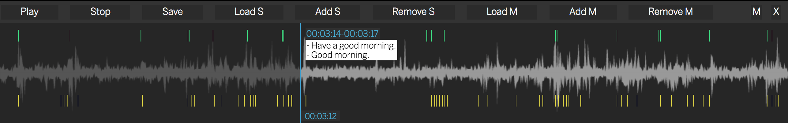

# Audioline

A graphical tool to edit and prototype events triggered by an audio source. Ideal for projects when a lot of events are fired at different times and you want to edit them in an easy way.

I built this specifically for [this project](https://github.com/cvalenzuela/bode.ga), where many subtitles and 3D models are triggered at very specific parts of an audio file.

Audioline is written in plain javascript and only depends on [wavesurfer](https://wavesurfer-js.org).
